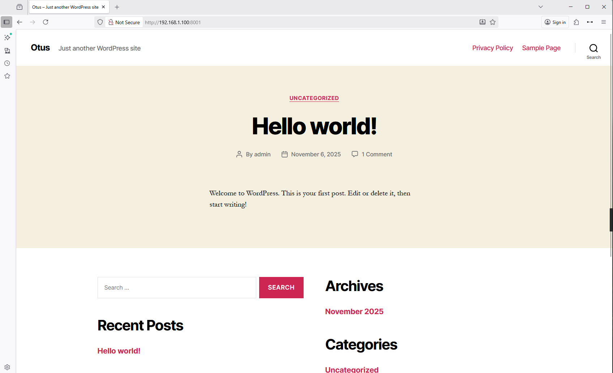
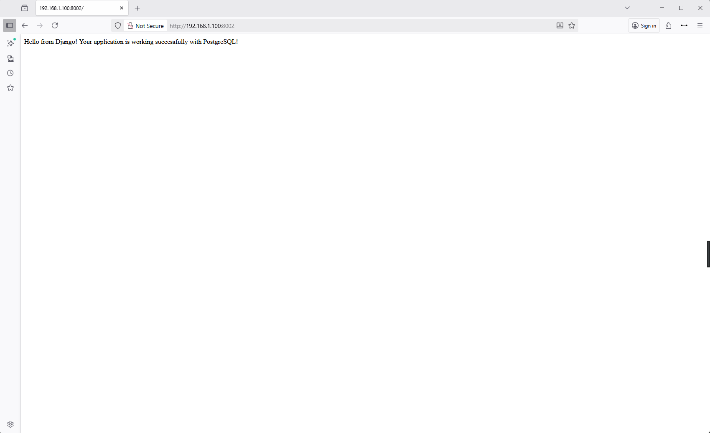
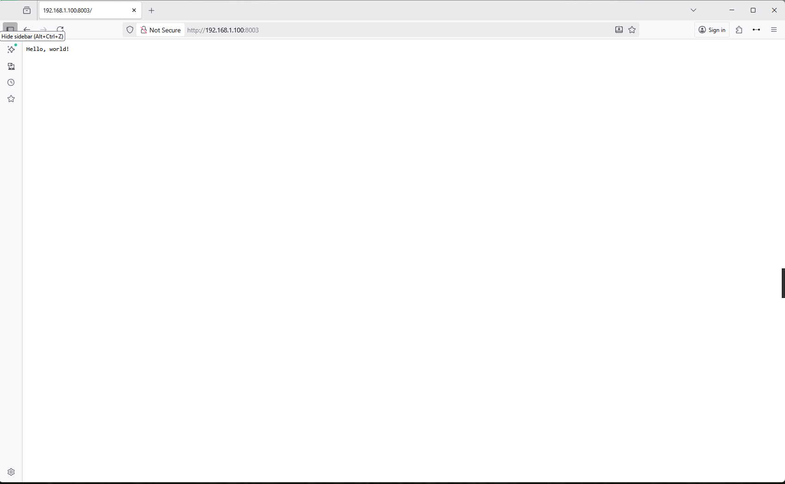
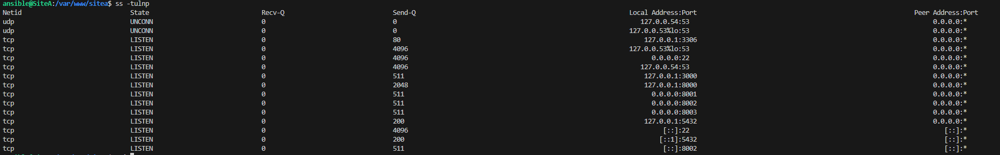

### 42 Динамический веб 

#### Домашнее задание
Что нужно сделать?

Варианты стенда:

nginx + php-fpm (laravel/wordpress) + python (flask/django) + js(react/angular);
nginx + java (tomcat/jetty/netty) + go + ruby;
можно свои комбинации.

Реализации на выбор:

на хостовой системе через конфиги в /etc;
деплой через docker-compose.

Для усложнения можно попросить проекты у коллег с курсов по разработке


К сдаче принимается:

vagrant стэнд с проброшенными на локалхост портами
каждый порт на свой сайт
через нжинкс

#### Решение

Результатом выполнения домашнего задания является Vagrant файл, который средствами ansible provisioning подготавливает сервер с сайтами:

Сайт A (nginx + php-fpm, Wordpress)
Сайт B (nginx + python)
Сайт C (nginx + NodeJS)
Запуск стенда

```bash
ansible-playbook main.yml --ask-vault-pass
```
#### Проверка сайта A (nginx + php-fpm)

В браузере Указывам в качестве веб адреса [http://192.168.1.100:8001](http://192.168.1.100:8001) 




#### Проверка сайта B (nginx + pyhon)

В браузере Указывам в качестве веб адреса [http://192.168.1.100:8002](http://192.168.1.100:8002) 




#### Проверка сайта C (nginx + Node Js)

В браузере Указывам в качестве веб адреса [http://192.168.1.100:8003](http://192.168.1.100:8003)




В качестве потверждения указываю открытые порты на данном веб сервере



